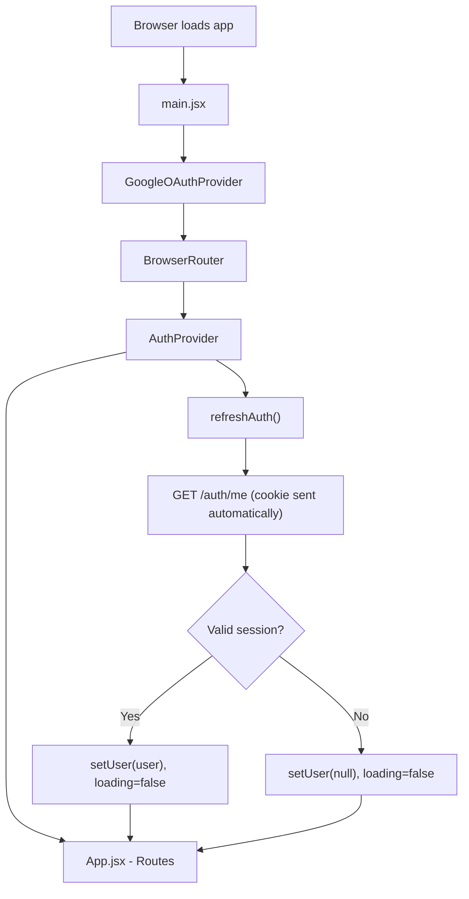
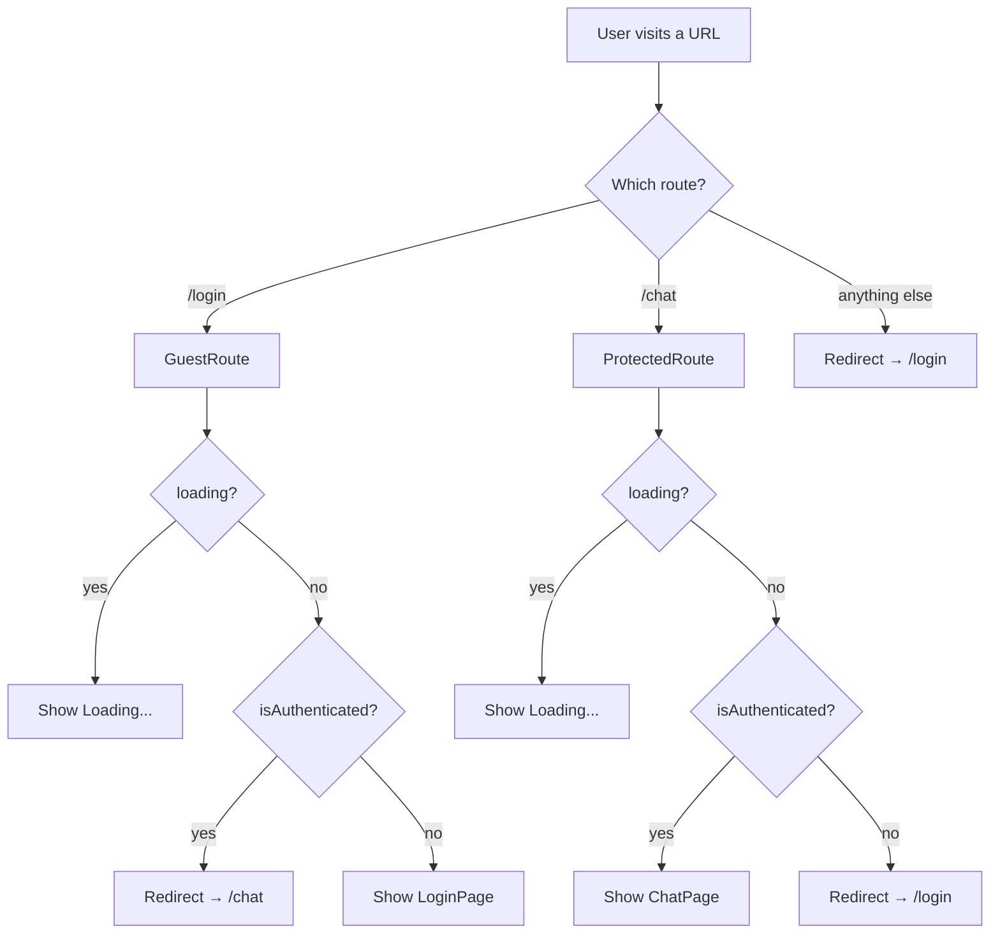
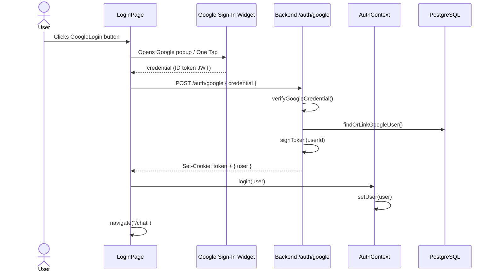
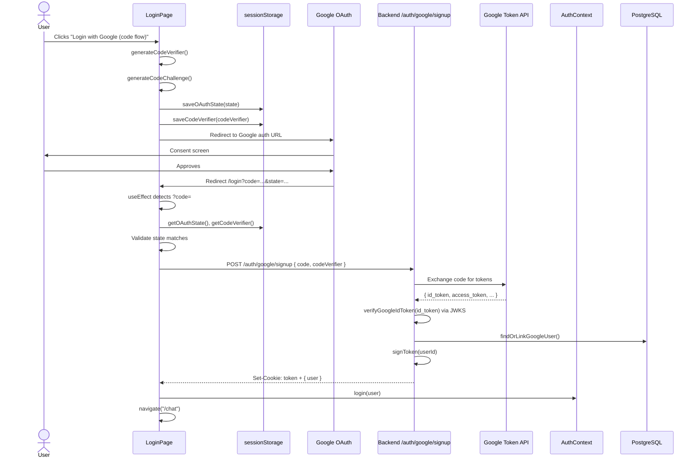
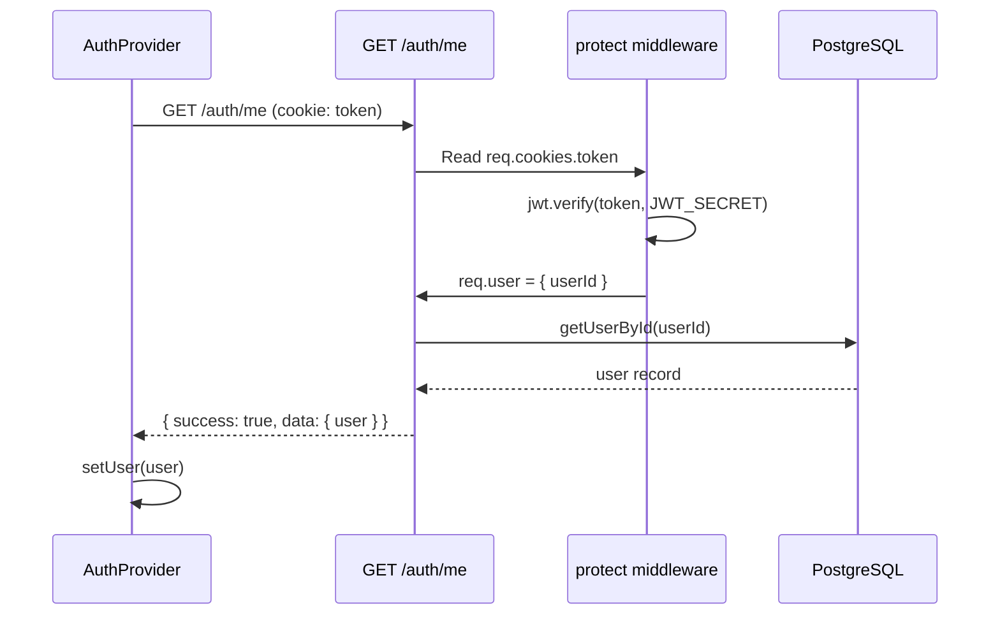
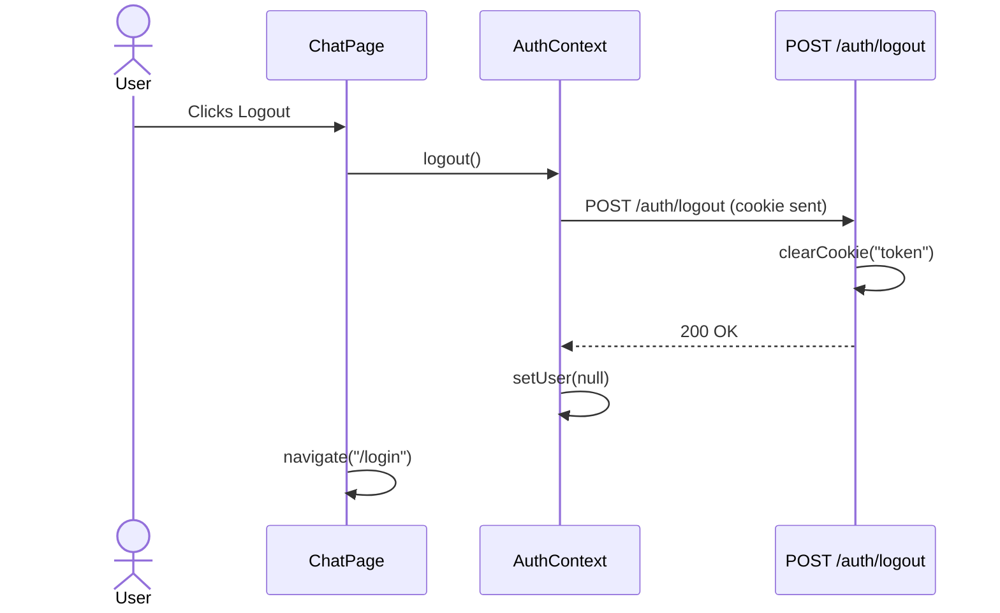
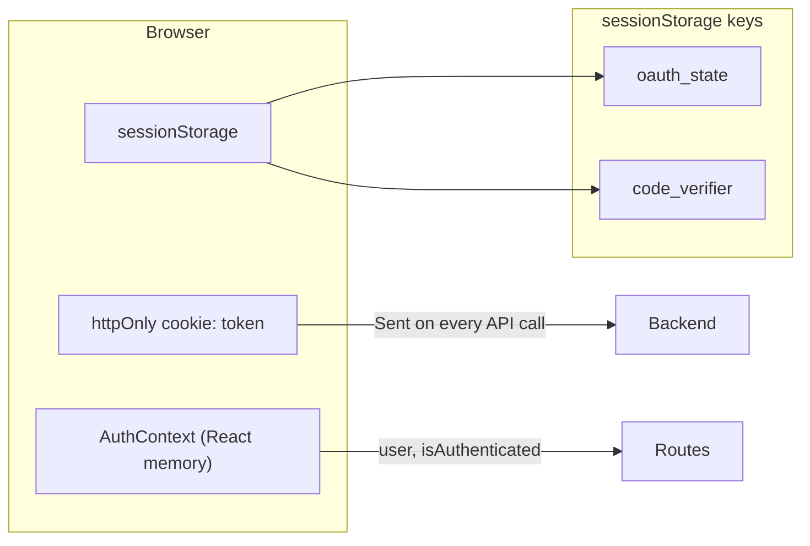

# GenPersona — Authentication Flow Guide

This document explains how login, session management, and route protection work in GenPersona after the latest changes (single `/login` page, AuthContext, ProtectedRoute, GuestRoute).

---

## Table of Contents

1. [Big Picture](#1-big-picture)
2. [App Startup](#2-app-startup)
3. [Route Protection](#3-route-protection)
4. [Login Method A — Google Button (ID Token)](#4-login-method-a--google-button-id-token)
5. [Login Method B — OAuth Code Flow + PKCE](#5-login-method-b--oauth-code-flow--pkce)
6. [Session Check (`/auth/me`)](#6-session-check-authme)
7. [Logout Flow](#7-logout-flow)
8. [Frontend Function Reference](#8-frontend-function-reference)
9. [Backend Function Reference](#9-backend-function-reference)
10. [API Endpoints](#10-api-endpoints)
11. [Storage & Cookies](#11-storage--cookies)
12. [Common Questions](#12-common-questions)

---

## 1. Big Picture

GenPersona uses **two layers of authentication**:

| Layer | What it is | Where it lives |
|-------|------------|----------------|
| **Google auth** | Proves identity via Google | Login only |
| **App session** | Your own JWT in an httpOnly cookie named `token` | All protected API calls |

The frontend cannot read the cookie (httpOnly). So it uses **AuthContext** to track whether the user is logged in by calling `GET /auth/me` once on app load.

```mermaid
flowchart TB
  subgraph Frontend
    Main[main.jsx]
    AuthProvider[AuthProvider]
    App[App.jsx]
    GuestRoute[GuestRoute /login]
    ProtectedRoute[ProtectedRoute /chat]
    LoginPage[LoginPage]
    ChatPage[ChatPage]
  end

  subgraph Backend
    AuthRoutes[/api/auth/*]
    Protect[protect middleware]
    DB[(PostgreSQL)]
  end

  Google[Google OAuth]

  Main --> AuthProvider --> App
  App --> GuestRoute --> LoginPage
  App --> ProtectedRoute --> ChatPage
  LoginPage --> Google
  LoginPage --> AuthRoutes
  AuthProvider --> AuthRoutes
  ChatPage --> AuthRoutes
  AuthRoutes --> DB
  Protect --> AuthRoutes
```

---

## 2. App Startup

When the browser loads the app, components mount in this order:



**Files involved:**
- `frontend/src/main.jsx` — wraps the app with providers
- `frontend/src/context/AuthContext.jsx` — calls `/auth/me` on mount

**Important:** While `loading === true`, both `GuestRoute` and `ProtectedRoute` show a loading screen. No page content renders until the session check finishes.

---

## 3. Route Protection



| Route | Wrapper | Logged out | Logged in |
|-------|---------|------------|-----------|
| `/login` | `GuestRoute` | Shows login page | Redirects to `/chat` |
| `/chat` | `ProtectedRoute` | Redirects to `/login` | Shows chat page |

**Why logged-in users can't visit `/login`:**
`GuestRoute` reads `isAuthenticated` from AuthContext. If `user` exists, it immediately renders `<Navigate to="/chat" />`.

---

## 4. Login Method A — Google Button (ID Token)

Uses the `@react-oauth/google` widget. No redirect. Google returns an ID token directly in JavaScript.



### Step-by-step

1. User clicks the Google button on `LoginPage`.
2. `handleGoogleSuccess(credentialResponse)` runs.
3. Frontend sends `credential` (Google ID token) to `POST /api/auth/google`.
4. Backend verifies token, creates/updates user, signs app JWT.
5. Backend sets httpOnly cookie `token` and returns `{ user }`.
6. Frontend calls `login(user)` to update AuthContext.
7. Frontend navigates to `/chat`.

---

## 5. Login Method B — OAuth Code Flow + PKCE

Uses the **"Login with Google (code flow)"** button. User is redirected to Google and back to `/login?code=...&state=...`.



### Phase 1 — Start login (`handleGoogleCodeLogin`)

| Step | What happens |
|------|--------------|
| 1 | Generate random `codeVerifier` (PKCE secret) |
| 2 | Generate random `state` (CSRF protection) |
| 3 | Hash verifier → `codeChallenge` (SHA-256) |
| 4 | Save `state` and `codeVerifier` in `sessionStorage` |
| 5 | Redirect browser to Google with `redirect_uri=/login` |

### Phase 2 — Google redirects back (`useEffect` on LoginPage)

| Step | What happens |
|------|--------------|
| 1 | Read `code`, `state`, `error` from URL |
| 2 | If no `code` and no `error` → do nothing (normal login page visit) |
| 3 | Validate `state` matches `sessionStorage` |
| 4 | Read `codeVerifier` from `sessionStorage` |
| 5 | POST `{ code, codeVerifier }` to backend |
| 6 | On success → `login(user)` + navigate to `/chat` |
| 7 | Clear OAuth params from URL |

### PKCE keys in sessionStorage

| Key | Saved by | Read by |
|-----|----------|---------|
| `oauth_state` | `saveOAuthState()` | `getOAuthState()` |
| `code_verifier` | `saveCodeVerifier()` | `getCodeVerifier()` |

---

## 6. Session Check (`/auth/me`)

Called **once** when the app loads (inside `AuthProvider`). Not called again on every route change.



If cookie is missing or invalid → API returns 401 → `setUser(null)` → user is treated as logged out.

---

## 7. Logout Flow



After logout:
- Cookie is cleared on server
- AuthContext `user` is `null`
- `isAuthenticated` becomes `false`
- Visiting `/chat` redirects to `/login`

---

## 8. Frontend Function Reference

### `frontend/src/main.jsx`

| What | Purpose |
|------|---------|
| `GoogleOAuthProvider` | Required wrapper for `@react-oauth/google` button |
| `BrowserRouter` | Enables React Router |
| `AuthProvider` | Provides auth state to entire app |

---

### `frontend/src/context/AuthContext.jsx`

#### `parseUserFromMeResponse(response)`
- **Input:** Axios response from `/auth/me`
- **Output:** User object or `null`
- **Checks:** `status === 200`, `success === true`, `user.id` is a string

#### `AuthProvider`
- **State:** `user`, `loading`
- **On mount:** Calls `refreshAuth()` then sets `loading = false`

#### `refreshAuth()`
- Calls `GET /auth/me`
- Sets `user` from response or `null` on failure
- **Returns:** user object or `null`

#### `login(authUser)`
- If `authUser.id` exists → sets user in context immediately (after login API)
- Otherwise → falls back to `refreshAuth()`

#### `logout()`
- Calls `POST /auth/logout`
- Always sets `user = null` in context

#### `useAuth()`
- Hook to access context from any component
- **Throws** if used outside `AuthProvider`

**Context value exposed:**
```js
{
  user,           // { id, email, name, avatar } or null
  loading,        // true while initial /auth/me is in flight
  isAuthenticated,// Boolean(user)
  login,
  logout,
  refreshAuth,
}
```

---

### `frontend/src/components/GuestRoute.jsx`

| Condition | Result |
|-----------|--------|
| `loading` | Show loading spinner |
| `isAuthenticated` | Redirect to `/chat` |
| else | Render children (LoginPage) |

---

### `frontend/src/components/ProtectedRoute.jsx`

| Condition | Result |
|-----------|--------|
| `loading` | Show loading spinner |
| `!isAuthenticated` | Redirect to `/login` |
| else | Render children (ChatPage) |

---

### `frontend/src/pages/LoginPage.jsx`

#### `handleGoogleCodeLogin()`
- Generates PKCE verifier + state
- Saves to sessionStorage
- Redirects browser to Google OAuth URL
- `redirect_uri` = `http://localhost:5173/login`

#### `handleGoogleSuccess(credentialResponse)`
- ID token flow (Google button)
- POST `/auth/google`
- `login(user)` + navigate to `/chat`

#### `useEffect` (OAuth callback handler)
- Runs when URL has `?code=` or `?error=`
- Validates state + codeVerifier
- POST `/auth/google/signup`
- `login(user)` + navigate to `/chat`
- Uses `handledRef` to prevent double execution (React Strict Mode)

---

### `frontend/src/pages/ChatPage.jsx`

#### `handleLogout()`
- Calls `logout()` from AuthContext
- Navigates to `/login`

#### `handleSend()`
- Sends chat message to backend (separate from auth)

---

### `frontend/src/lib/utils.js` (OAuth helpers)

| Function | Purpose |
|----------|---------|
| `generateCodeVerifier()` | Random 32-byte string for PKCE |
| `generateCodeChallenge(verifier)` | SHA-256 hash of verifier |
| `saveOAuthState(state)` | Save CSRF state → `sessionStorage.oauth_state` |
| `saveCodeVerifier(verifier)` | Save PKCE secret → `sessionStorage.code_verifier` |
| `getOAuthState()` | Read saved state |
| `getCodeVerifier()` | Read saved verifier |

---

### `frontend/src/lib/api.js`

- Axios instance with `withCredentials: true`
- **Critical:** This sends the httpOnly cookie on every request automatically

---

## 9. Backend Function Reference

### `auth.controller.js`

#### `sendAuthResponse(res, result, message)`
- Sets cookie: `token = result.token`
- Returns JSON: `{ user: result.user }`

#### `googleAuthController`
- Route: `POST /auth/google`
- Input: `{ credential }` (Google ID token from button flow)
- Calls `googleAuth()` → `sendAuthResponse()`

#### `googleSignupController`
- Route: `POST /auth/google/signup`
- Input: `{ code, codeVerifier }`
- Calls `googleSignup()` → `sendAuthResponse()`

#### `meController`
- Route: `GET /auth/me` (protected)
- Returns current user from DB using `req.user.userId`

#### `logoutController`
- Route: `POST /auth/logout` (protected)
- Clears `token` cookie

---

### `auth.service.js`

#### `verifyGoogleCredential(credential)`
- Uses `google-auth-library` to verify Google ID token
- Returns profile: `{ googleId, email, name, avatar }`

#### `verifyGoogleIdToken(token)` *(your custom JWKS verification)*
- Decodes JWT header to get `kid`
- Fetches public key from Google JWKS
- Verifies signature, audience, issuer
- Used in code flow after token exchange

#### `getSigningKey(kid)` / `getJwksClient()`
- Helpers for JWKS key lookup

#### `findOrLinkGoogleUser(profile)`
- Find user by `googleId` → update if exists
- Else find by `email` → link Google account
- Else create new user

#### `signToken(userId)`
- Signs app JWT with `JWT_SECRET`, expires in 7 days

#### `googleAuth(credential)`
- Button flow: verify credential → user → JWT

#### `googleSignup(code, codeVerifier)`
- Code flow:
  1. Exchange code at Google token endpoint (with client_secret)
  2. Get `id_token` from response
  3. Verify with `verifyGoogleIdToken()`
  4. Create/link user → sign app JWT

#### `getCookieOptions()`
- `httpOnly: true`
- `secure: true` in production
- `sameSite: lax` (dev) / `none` (production)
- `maxAge: 7 days`

---

### `auth.middleware.js`

#### `protect(req, res, next)`
- Reads `req.cookies.token`
- Verifies JWT with `JWT_SECRET`
- Sets `req.user = { userId }`
- Returns 401 if missing/invalid

---

## 10. API Endpoints

| Method | Path | Auth required | Purpose |
|--------|------|---------------|---------|
| POST | `/api/auth/google` | No | Login via Google button (ID token) |
| POST | `/api/auth/google/signup` | No | Login via OAuth code + PKCE |
| GET | `/api/auth/me` | Yes | Get current user / verify session |
| POST | `/api/auth/logout` | Yes | Clear session cookie |

---

## 11. Storage & Cookies



| Storage | Key | Lifetime | Purpose |
|---------|-----|----------|---------|
| Cookie | `token` | 7 days | App session JWT (httpOnly) |
| sessionStorage | `oauth_state` | Until tab closes | CSRF protection for OAuth |
| sessionStorage | `code_verifier` | Until tab closes | PKCE secret for code exchange |
| React state | `user` in AuthContext | Until page refresh / logout | UI auth state |

---

## 12. Common Questions

### Why can't JavaScript read the cookie?
The cookie is `httpOnly`. Only the browser sends it automatically to the backend. That's why we call `/auth/me` to know if the user is logged in.

### Why call `/auth/me` only once?
`AuthProvider` calls it on app load. Routes read from context — no duplicate API calls per page.

### Why two Google login buttons?
| Button | Flow | Best for |
|--------|------|----------|
| GoogleLogin widget | ID token in JS | Simple sign-in |
| Code flow button | Redirect + PKCE | Future Google API access (Gmail, Calendar, etc.) |

### What if I visit `/login` while logged in?
`GuestRoute` redirects you to `/chat` automatically.

### What if I visit `/chat` while logged out?
`ProtectedRoute` redirects you to `/login`.

### What happens on page refresh?
1. AuthProvider mounts again
2. `/auth/me` is called
3. Cookie still valid → user stays logged in
4. Cookie expired → user sent to login when visiting protected routes

---

## File Map

```
frontend/
├── src/
│   ├── main.jsx                 # Provider tree
│   ├── App.jsx                  # Routes + Guest/Protected wrappers
│   ├── context/
│   │   └── AuthContext.jsx      # Central auth state
│   ├── components/
│   │   ├── GuestRoute.jsx       # Blocks /login when authenticated
│   │   └── ProtectedRoute.jsx   # Blocks /chat when not authenticated
│   ├── pages/
│   │   ├── LoginPage.jsx        # Login UI + OAuth callback
│   │   └── ChatPage.jsx         # Protected chat + logout
│   └── lib/
│       ├── api.js               # Axios + withCredentials
│       └── utils.js             # PKCE + OAuth sessionStorage helpers

backend/
└── src/modules/auth/
    ├── auth.routes.js           # Route definitions
    ├── auth.controller.js       # HTTP layer + set cookie
    ├── auth.service.js          # Business logic + Google verification
    └── auth.middleware.js       # protect() JWT check
```

---

*Last updated: matches codebase with AuthContext, single `/login` callback, and JWKS verification in `googleSignup`.*
